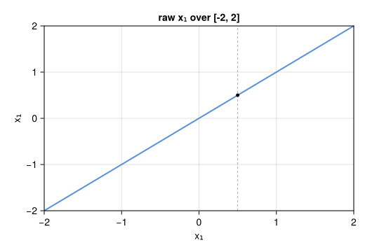
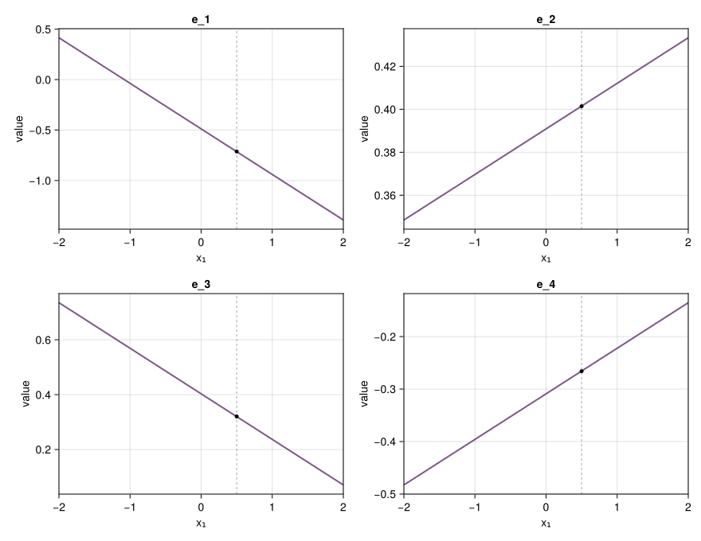
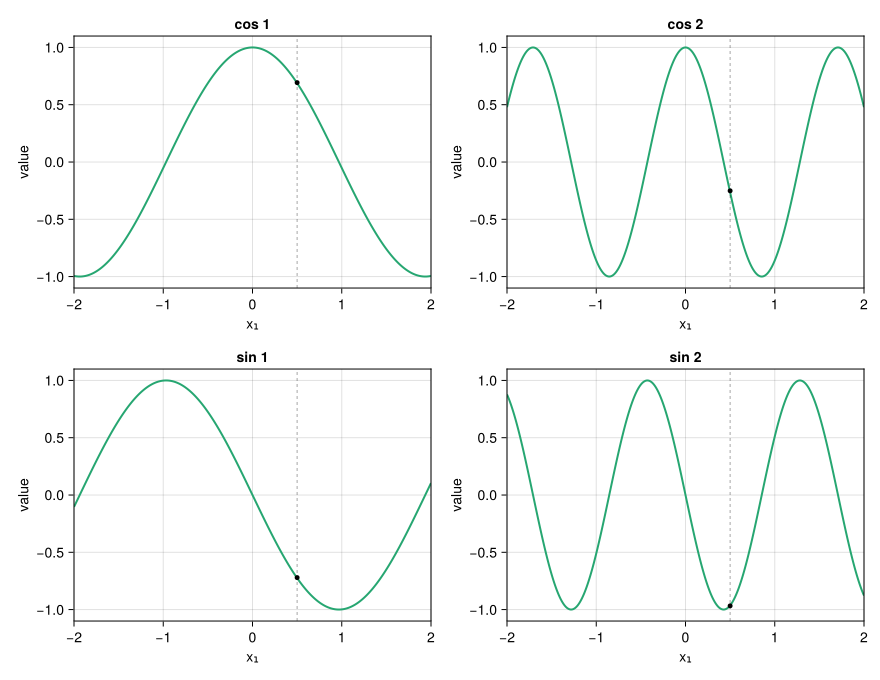
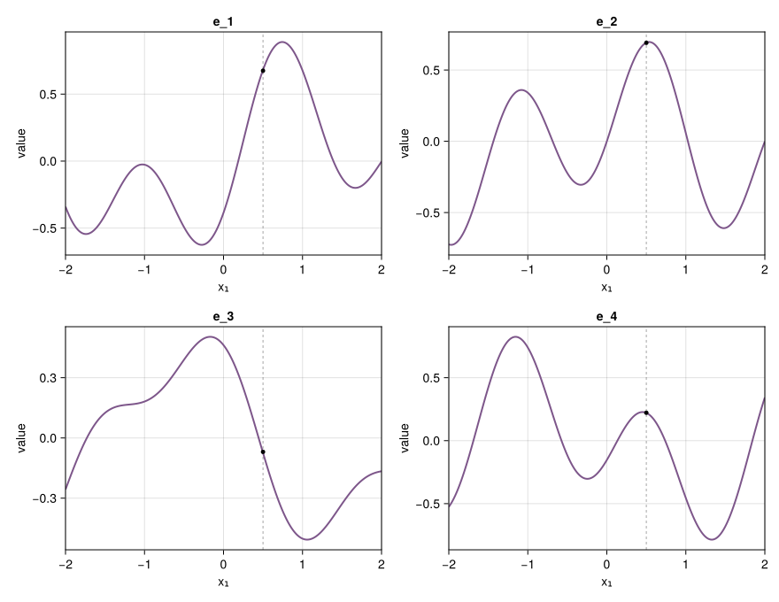
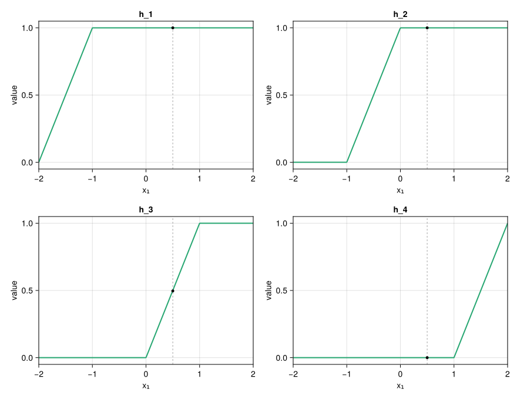
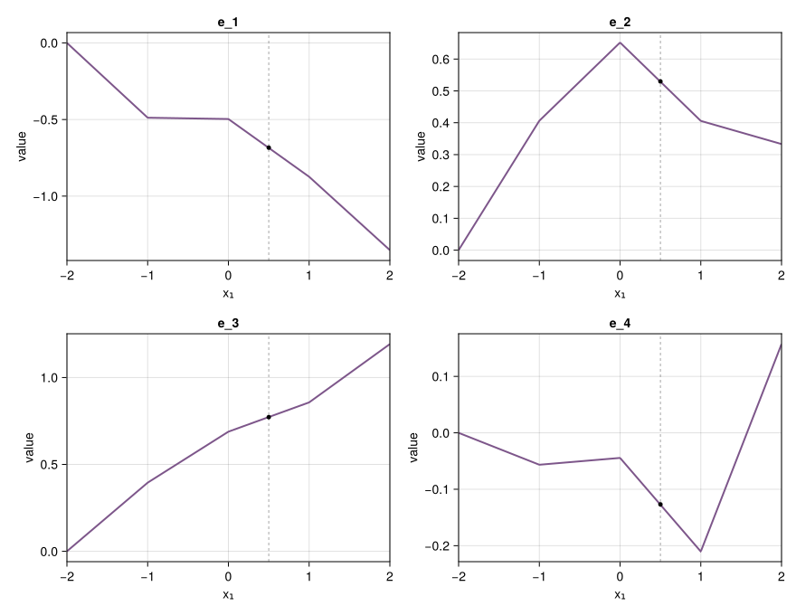
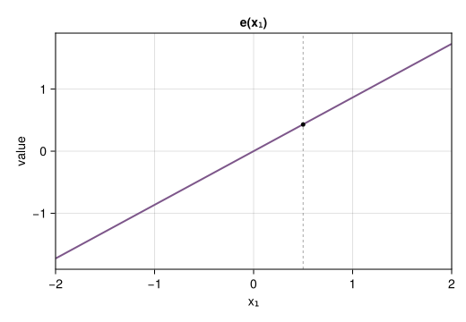
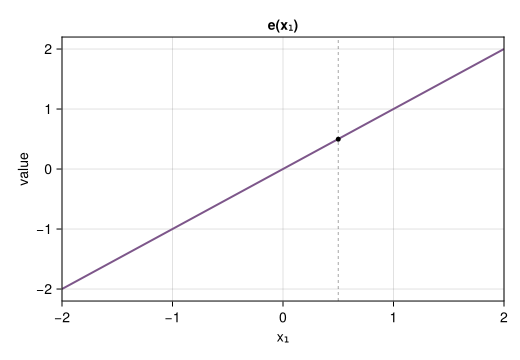
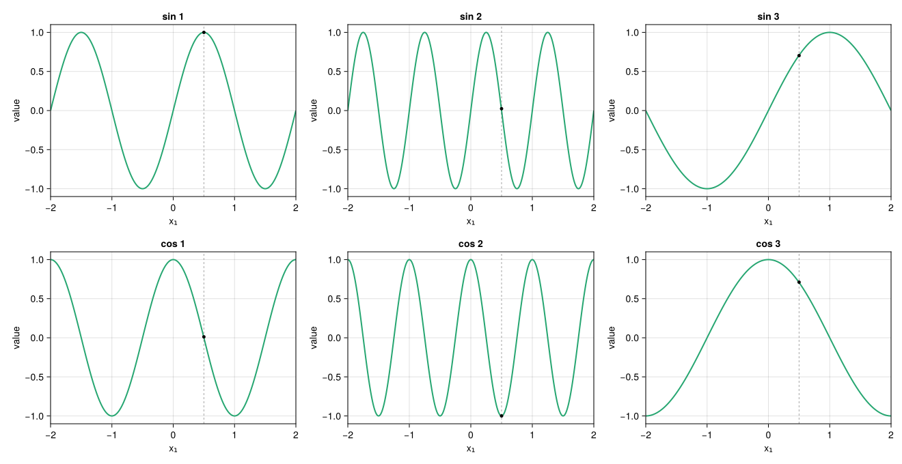
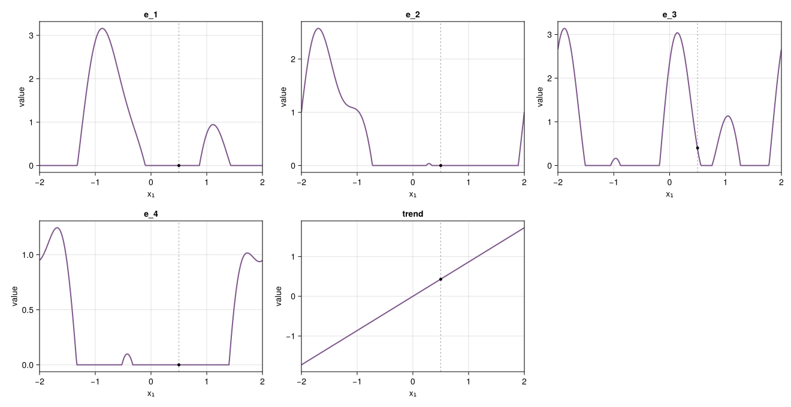

# Embeddings
Evovest

- [Setup](#setup)
- [Numerical embeddings](#numerical-embeddings)
  - [LinearEmbeddings](#linearembeddings)
  - [PeriodicEmbeddings](#periodicembeddings)
  - [PiecewiseLinearEmbeddings](#piecewiselinearembeddings)
  - [BatchNormEmbeddings](#batchnormembeddings)
  - [IdentityEmbedding](#identityembedding)
- [Temporal embeddings](#temporal-embeddings)
  - [TemporalEmbeddings](#temporalembeddings)
  - [EmbeddingLayer](#embeddinglayer)

Embeddings map each raw column into a representation the backbone
consumes. Numerical embeddings act column-wise. A temporal embedding
reserves one time column; `EmbeddingLayer` concatenates that branch
last. Piecewise-linear and temporal embeddings need training data at
build time (`needs_x_train`).

## Setup

Every block below uses the same scalar $x_1$ over $[-2, 2]$, the same
mark $x_1=0.5$, and the same init seed. Figures are split by stage:

1.  **raw** — $x_1 \mapsto x_1$
2.  **basis** — intermediate $h(x_1)$, when the map has one
3.  **embedding** — coordinates $e_k(x_1)$

Expanding embeddings use `d_embedding=4` and `activation=:identity` so
the geometry is visible; Linear and Periodic default to `:relu` in the
constructor.

    e_titles (generic function with 1 method)



## Numerical embeddings

Each numerical config is applied independently to every non-time column.
Expanding types emit $d_{emb}=4$ coordinates; BatchNorm and Identity
keep width 1.

### LinearEmbeddings

The simplest expansion: each embedding coordinate is an independent
affine map of the same scalar.

$$e_k(x_1)=\phi(w_k x_1+b_k),\quad k=1,\ldots,d_{emb}$$

One number $x_1$ becomes a vector whose coordinates are lines with
different slopes $w_k$ and intercepts $b_k$. There is no intermediate
basis. With $\phi=\mathrm{id}$ (as plotted), the grid is those lines;
the default `:relu` would zero the negative half of each coordinate.

``` julia
conf_linear = LinearEmbeddings(; d_embedding, activation=:identity)
layer_linear, ps_linear, st_linear = setup_embedding(conf_linear)
y_linear = embed_grid(layer_linear, ps_linear, st_linear, xgrid)
embed_point(layer_linear, ps_linear, st_linear, x1)
```

    4-element Vector{Float32}:
     -0.7141968
      0.40148556
      0.3199348
     -0.26569



### PeriodicEmbeddings

Periodic embedding first lifts $x_1$ into $2K$ learned sinusoids, then
projects that basis to $d_{emb}$:

$$z_k(x_1)=2\pi w_k x_1$$

$$h(x_1)=[\cos z(x_1),\ \sin z(x_1)]\in\mathbb{R}^{2K}$$

$$e(x_1)=\phi(W h(x_1)+b)$$

The frequencies $w_k$ are learned (Gaussian init, here scaled up so the
waves are visible on $[-2,2]$). Each $e_k$ is a linear mixture of those
sinusoids. `lite=true` shares $W$ across features; the figures use the
default per-feature map.

``` julia
K = 2
conf_periodic = PeriodicEmbeddings(;
    d_embedding, frequencies=K, frequencies_init_scale=0.4f0, activation=:identity, lite=false
)
layer_periodic, ps_periodic, st_periodic = setup_embedding(conf_periodic)
h_periodic = basis_grid(layer_periodic, ps_periodic, st_periodic, xgrid, :periodic)
y_periodic = embed_grid(layer_periodic, ps_periodic, st_periodic, xgrid)
embed_point(layer_periodic, ps_periodic, st_periodic, x1)
```

    4-element Vector{Float32}:
      0.68084216
      0.6917712
     -0.07447859
      0.2205313

**Basis** — $\cos z_k$ then $\sin z_k$:



**Projected embedding:**



### PiecewiseLinearEmbeddings

Bin edges come from training quantiles. Each bin $b=[l_b,r_b]$
contributes a saturating ramp, and a learned map sends that encoding to
$d_{emb}$:

$$h_b(x_1)=clamp((x_1-l_b)/(r_b-l_b), 0, 1),\quad b=1,\ldots,B$$

$$e(x_1)=\phi(W h(x_1)+b)$$

$h_b$ is $0$ left of $l_b$, linear inside the bin, and $1$ right of
$r_b$, so each $e_k$ is piecewise linear with kinks at the edges.
Version `:A` (plotted) is that map. Version `:B` adds a residual linear
path $r(x_1)$ and zero-initializes $W$, so at init `:B` looks like
`LinearEmbeddings`. This config requires `x_train`.

``` julia
conf_piecewise = PiecewiseLinearEmbeddings(; d_embedding, bins=4, activation=:identity, version=:A)
bins = Embeddings.compute_bins(x_train; bins=4)[1]
layer_piecewise, ps_piecewise, st_piecewise = setup_embedding(conf_piecewise; x_train)
h_piecewise = basis_grid(layer_piecewise, ps_piecewise, st_piecewise, xgrid, :encoding)
y_piecewise = embed_grid(layer_piecewise, ps_piecewise, st_piecewise, xgrid)
(; bins, e_x1=embed_point(layer_piecewise, ps_piecewise, st_piecewise, x1))
```

    (bins = Float32[-2.0, -1.0, 0.0, 1.0, 2.0], e_x1 = Float32[-0.6851754, 0.52889746, 0.77274066, -0.12734753])

**Basis** — one ramp per bin:



**Projected embedding:**



### BatchNormEmbeddings

Width stays 1: the feature is standardized, then optionally rescaled.

$$e(x_1)=\gamma\frac{x_1-\mu}{\sqrt{\sigma^2+\epsilon}}+\beta$$

On this figure $\mu$ and $\sigma$ are the mean and variance of the
displayed grid (as if that grid were one batch) and
$(\gamma,\beta)=(1,0)$ at init, so $e$ is a centered, unit-scale copy of
the raw line. During training those statistics come from each minibatch;
at inference they are running averages.

``` julia
conf_batchnorm = BatchNormEmbeddings()
layer_batchnorm, ps_batchnorm, st_batchnorm = setup_embedding(conf_batchnorm)
y_batchnorm = embed_grid(layer_batchnorm, ps_batchnorm, st_batchnorm, xgrid)
embed_point(layer_batchnorm, ps_batchnorm, st_batchnorm, x1)
```

    1-element Vector{Float32}:
     0.0



### IdentityEmbedding

The default numerical embedding: the backbone sees the raw column.

$$e(x_1)=x_1$$

The curve matches the raw figure above; only the series color (embedding
purple) changes.

``` julia
conf_identity = IdentityEmbedding()
layer_identity, ps_identity, st_identity = setup_embedding(conf_identity)
y_identity = embed_grid(layer_identity, ps_identity, st_identity, xgrid)
embed_point(layer_identity, ps_identity, st_identity, x1)
```

    1-element Vector{Float32}:
     0.5



## Temporal embeddings

Temporal embedding is a separate branch on one time column, not a
column-wise numerical map. It is always attached through
`EmbeddingLayer`, which routes that column to `temp` and concatenates
the result after the numerical features.

### TemporalEmbeddings

Fixed harmonics (not learned frequencies) of periods $T_i$ are
projected, then an optional standardized trend is appended:

$$\omega_{i,k}=2\pi k/T_i,\quad k=1,\ldots,o_i$$

$$h(t)=[\sin(\omega t),\ \cos(\omega t)]$$

$$e(t)=[\phi(W h(t)+b),\ (t-\mu)/\sigma]$$

Defaults assume a POSIX-seconds column (`year`, `month`, `week`, `day`).
The figure uses short periods so the same $[-2,2]$ path shows several
cycles. Build it through `EmbeddingLayer` with `x_train` (for
$\mu,\sigma$). Output width is $d_{emb}+1$ when `trend=true`; the last
coordinate is the trend.

``` julia
order = [2, 1]
periods = Float32[2, 4]
conf_temporal = EmbeddingLayer(; temp=TemporalEmbeddings(; index=1, order, periods, trend=true, d_embedding))
layer_temporal, ps_temporal, st_temporal = setup_embedding(conf_temporal; x_train)
h_temporal = temporal_basis(layer_temporal, ps_temporal, st_temporal, xgrid)
y_temporal = embed_grid(layer_temporal, ps_temporal, st_temporal, xgrid)
n_harm = sum(order)
embed_point(layer_temporal, ps_temporal, st_temporal, x1)
```

    5-element Vector{Float32}:
     0.0
     0.0
     0.3734188
     0.0
     0.4313913

**Basis** — $\sin$ then $\cos$ of each harmonic:



**Projected embedding** — $e_k=\mathrm{ReLU}(W h+b)$, last panel is the
trend:



### EmbeddingLayer

The rest of this report built a **numerical** config for a single
column. A real table has several numeric columns and, sometimes, one
time column. `EmbeddingLayer` is the wrapper that says how those two
kinds of columns are treated.

``` text
input columns:   [  x1   x2   x3   t  ]
                    └─────────┘    │
                         num       temp  (temp.index = 4)
                           │       │
                           └─ vcat ┘  →  backbone
```

- `num` — applied to every column **except** the time column. Default:
  `IdentityEmbedding()` (pass-through).
- `temp` — applied to **one** column, whose position is `temp.index`
  (1-based in the feature list). Default: `nothing` (no time branch).

You pass this object as `embedding_config` when fitting; `fit` then
builds the chain. The snippets below call `build_embedding_chain` only
to show widths.

**Numerical only** (equivalent to passing `LinearEmbeddings` directly,
as earlier sections did):

``` julia
EmbeddingLayer(; num=LinearEmbeddings(; d_embedding, activation=:identity))
```

    EmbeddingLayer{LinearEmbeddings, Nothing}(LinearEmbeddings(4, :identity), nothing)

**Temporal only** — numeric columns pass through; column `index` is the
timestamp:

``` julia
EmbeddingLayer(; temp=TemporalEmbeddings(; index=1, d_embedding))
```

    EmbeddingLayer{IdentityEmbedding, TemporalEmbeddings}(IdentityEmbedding(), TemporalEmbeddings(1, [4, 1, 7, 0], Float32[3.15576f7, 2.6298f6, 604800.0, 86400.0], true, 4))

**Both** — two columns, `x1` then `t`. `index=2` means “the second
column is time”, not embedding width:

``` julia
nfeats = 2          # columns in the table
time_column = 2     # t is column 2
conf_combo = EmbeddingLayer(;
    num=LinearEmbeddings(; d_embedding, activation=:identity),
    temp=TemporalEmbeddings(; index=time_column, order=[2], periods=Float32[4], trend=true, d_embedding),
)
x_train2 = hcat(collect(xgrid), collect(xgrid))  # (n_samples, nfeats): [x1 | t]
layer_combo = Embeddings.build_embedding_chain(conf_combo, nfeats; x_train=x_train2)

# widths: one numeric feature → d_embedding; time → d_embedding projection + 1 trend
n_numeric = nfeats - 1
width_num = n_numeric * d_embedding
width_temp = d_embedding + 1
batch = randn(Float32, nfeats, 4)  # (nfeats, batch) dummy input

(;
    width_num,
    width_temp,
    concatenated=width_num + width_temp,
    measured=Embeddings.embedding_width(layer_combo, batch, Xoshiro(seed)),
)
```

    (width_num = 4, width_temp = 5, concatenated = 9, measured = 9)

The second argument of `build_embedding_chain` is `nfeats` (how many
columns the matrix has), not `temp.index`. `x_train` is
`(n_samples, nfeats)`.

For hyperparameter search, a `Dict` is accepted: `:embedding_type`
selects `num` (`:linear`, `:periodic`, `:piecewise`, `:batchnorm`,
`:layernorm`, `:identity`), and `:temporal => Dict(:index => 2, ...)` builds `temp`.
Unknown keys are ignored.
