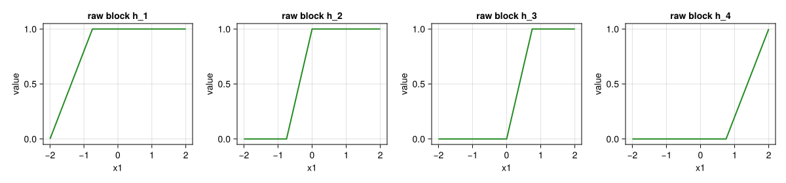
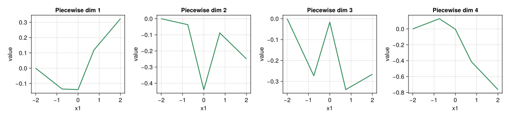
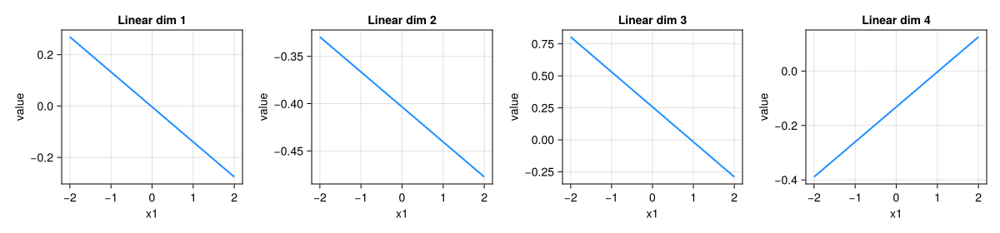
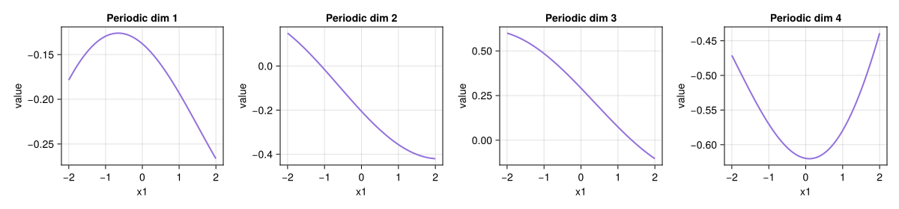
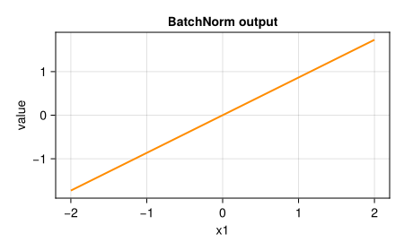
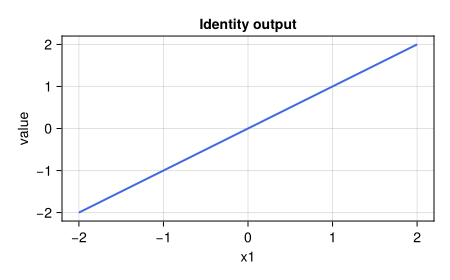

# Embeddings
Evovest

- [Setup](#setup)
- [PiecewiseLinearEmbeddings](#piecewiselinearembeddings)
  - [Piecewise Raw Blocks](#piecewise-raw-blocks)
  - [Piecewise Projected Embedding](#piecewise-projected-embedding)
- [LinearEmbeddings](#linearembeddings)
- [PeriodicEmbeddings](#periodicembeddings)
- [BatchNormEmbeddings](#batchnormembeddings)
- [IdentityEmbedding](#identityembedding)

## Setup

``` julia
using NeuroTabModels
using NeuroTabModels.Models: PiecewiseLinearEmbeddings, LinearEmbeddings, PeriodicEmbeddings, BatchNormEmbeddings, IdentityEmbedding
using Random
using CairoMakie
using Statistics
using DataFrames
```

We track one scalar feature `x1` and inspect how each numerical
embedding maps it over a range.

``` julia
function make_projector(spec; x_train=nothing)
  rng = MersenneTwister(seed)
  layer = NeuroTabModels.Models.Embeddings.build_embedding_chain(spec, 1; x_train)
  ps, st = NeuroTabModels.Models.Embeddings.LuxCore.setup(rng, layer)
  st = NeuroTabModels.Models.Embeddings.LuxCore.trainmode(st)

  return xvals -> begin
    x = reshape(Float32.(collect(xvals)), 1, :)
    y, _ = layer(x, ps, st)
    Array(y)
  end
end

xgrid = range(-2f0, 2f0; length=1000)
x1 = 0.35f0
seed = 123

function plot_embedding_dims(y, title_prefix; color=:steelblue)
  fig = Figure(size=(1200, 280))
  for k in 1:size(y, 1)
    ax = Axis(fig[1, k], title="$(title_prefix) dim $k", xlabel="x1", ylabel="value")
    lines!(ax, xgrid, vec(y[k, :]), linewidth=2, color=color)
  end
  return fig
end

function plot_scalar_curve(xvals, yvals, title; color=:black)
  fig = Figure(size=(450, 280))
  ax = Axis(fig[1, 1], title=title, xlabel="x1", ylabel="value")
  lines!(ax, xvals, yvals, color=color, linewidth=2)
  return fig
end

function plot_piecewise_blocks(xvals, h; color=:forestgreen)
  fig = Figure(size=(1200, 280))
  for b in 1:size(h, 1)
    ax = Axis(fig[1, b], title="raw block h_$b", xlabel="x1", ylabel="value")
    lines!(ax, xvals, vec(h[b, :]), linewidth=2, color=color)
    ylims!(ax, -0.05, 1.05)
  end
  return fig
end
```

    plot_piecewise_blocks (generic function with 1 method)

All comparisons below use the same raw feature path (`x1` over `xgrid`)
and the same initialization seed.

## PiecewiseLinearEmbeddings

For one feature `x1`, piecewise embedding is:

*h*<sub>*b*</sub>(*x*<sub>1</sub>) = clamp(*w*<sub>*b*</sub>*x*<sub>1</sub> + *c*<sub>*b*</sub>, 0, 1),  *b* = 1, …, *B*

*e*(*x*<sub>1</sub>) = *ϕ*(*W**h*(*x*<sub>1</sub>) + *r*(*x*<sub>1</sub>))

Version `:B` adds the residual linear path *r*(*x*<sub>1</sub>).

To make the intuition explicit, we visualize two stages separately:

- raw piecewise blocks *h*<sub>*b*</sub>(*x*<sub>1</sub>) from bins
- projected embedding *e*(*x*<sub>1</sub>) after the learnable linear
  map

``` julia
x_train = reshape(Float32[-2, -1, -0.5, 0, 0.5, 1, 2], :, 1)  # (n_samples, n_features)
bins = NeuroTabModels.Models.Embeddings.compute_bins(x_train; bins=4)[1]
bins
```

    5-element Vector{Float32}:
     -2.0
     -0.75
      0.0
      0.75
      2.0

### Piecewise Raw Blocks

``` julia
function piecewise_blocks(xvals, edges)
  nb = length(edges) - 1
  h = zeros(Float32, nb, length(xvals))
  for b in 1:nb
    left = edges[b]
    right = edges[b + 1]
    width = right - left
    @assert width > 0 "Bin edges must be strictly increasing"
    h[b, :] .= clamp.((Float32.(xvals) .- left) ./ width, 0f0, 1f0)
  end
  return h
end

h_piecewise = piecewise_blocks(xgrid, bins)

# Use :A so projected piecewise behavior is visible directly.
# At init, :B includes a residual linear path and the piecewise branch is zero-initialized.
spec_piecewise = PiecewiseLinearEmbeddings(d_embedding=4, bins=4, activation=:identity, version=:A)
proj_piecewise = make_projector(spec_piecewise; x_train=x_train)
y_piecewise = proj_piecewise(xgrid)
vec(proj_piecewise([x1])[:, 1])
```

    4-element Vector{Float32}:
     -0.018992329
     -0.27601132
     -0.16706881
     -0.19363779

``` julia
fig_blocks = plot_piecewise_blocks(xgrid, h_piecewise; color=:forestgreen)
fig_blocks
```



### Piecewise Projected Embedding

``` julia
fig_piecewise = plot_embedding_dims(y_piecewise, "Piecewise"; color=:seagreen)
fig_piecewise
```



## LinearEmbeddings

For one feature `x1`, linear embedding is:
*e*(*x*<sub>1</sub>) = *ϕ*(*w**x*<sub>1</sub> + *b*),  *e*(*x*<sub>1</sub>) ∈ ℝ<sup>*d*<sub>*e**m**b*</sub></sup>

``` julia
spec_linear = LinearEmbeddings(d_embedding=4, activation=:identity)
proj_linear = make_projector(spec_linear)
y_linear = proj_linear(xgrid)
```

    4×1000 Matrix{Float32}:
      0.268967   0.268421   0.267876  …  -0.275073  -0.275619  -0.276165
     -0.329523  -0.329672  -0.32982      -0.47716   -0.477308  -0.477456
      0.803674   0.80258    0.801485     -0.287593  -0.288688  -0.289783
     -0.388851  -0.388336  -0.387822      0.124117   0.124632   0.125146

``` julia
fig_linear = plot_embedding_dims(y_linear, "Linear"; color=:dodgerblue)
fig_linear
```



## PeriodicEmbeddings

Periodic embedding first makes sinusoidal features, then projects:

``` julia
spec_periodic = PeriodicEmbeddings(d_embedding=4, frequencies=4, frequencies_init_scale=0.05f0, activation=:identity, lite=false)
proj_periodic = make_projector(spec_periodic)
y_periodic = proj_periodic(xgrid)
```

    4×1000 Matrix{Float32}:
     -0.178505  -0.178202  -0.177899  …  -0.265849  -0.266134  -0.266418
      0.148926   0.148392   0.147856     -0.419773  -0.419821  -0.419867
      0.59965    0.599402   0.599153     -0.102548  -0.103113  -0.103676
     -0.471047  -0.47147   -0.471893     -0.440463  -0.439723  -0.438981

``` julia
fig_periodic = plot_embedding_dims(y_periodic, "Periodic"; color=:mediumpurple)
fig_periodic
```



## BatchNormEmbeddings

BatchNorm embedding keeps width 1 per feature and normalizes:
$$e(x_1)=\gamma\frac{x_1-\mu}{\sqrt{\sigma^2+\varepsilon}}+\beta$$

``` julia
spec_batchnorm = BatchNormEmbeddings()
proj_batchnorm = make_projector(spec_batchnorm)
y_batchnorm = proj_batchnorm(xgrid)
```

    ┌ Warning: `training` is set to `Val{true}()` but is not being used within an autodiff call (gradient, jacobian, etc...). This will be slow. If you are using a `Lux.jl` model, set it to inference (test) mode using `LuxCore.testmode`. Reliance on this behavior is discouraged, and is not guaranteed by Semantic Versioning, and might be removed without a deprecation cycle. It is recommended to fix this issue in your code.
    └ @ LuxLib.Utils C:\Users\jerem\.julia\packages\LuxLib\zPBrt\src\utils.jl:346

    1×1000 Matrix{Float32}:
     -1.73031  -1.72685  -1.72338  …  1.71992  1.72338  1.72685  1.73031

``` julia
fig_batchnorm = plot_scalar_curve(xgrid, vec(y_batchnorm[1, :]), "BatchNorm output"; color=:darkorange)
fig_batchnorm
```



## IdentityEmbedding

Identity embedding is unchanged input:
*e*(*x*<sub>1</sub>) = *x*<sub>1</sub>

``` julia
spec_identity = IdentityEmbedding()
proj_identity = make_projector(spec_identity)
y_identity = proj_identity(xgrid)
```

    1×1000 Matrix{Float32}:
     -2.0  -1.996  -1.99199  -1.98799  -1.98398  …  1.98799  1.99199  1.996  2.0

``` julia
fig_identity = plot_scalar_curve(xgrid, vec(y_identity[1, :]), "Identity output"; color=:royalblue)
fig_identity
```


