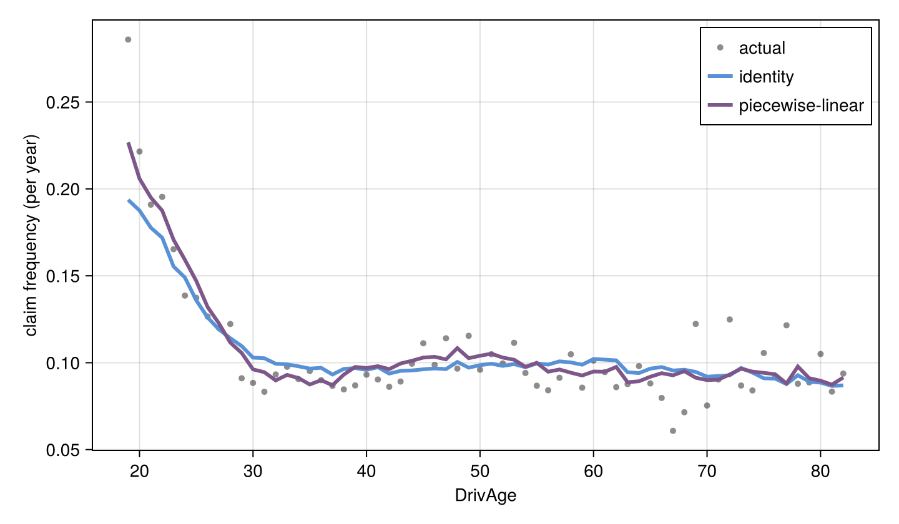

# Numerical embeddings on insurance claim frequency

How often a driver makes a claim doesn't change in a straight line with their details. Very young drivers claim a lot, the rate drops quickly through the twenties, then stays fairly flat. A neural network that reads each number as a single raw value tends to smooth out bends like this. Numerical embeddings turn each number into a small vector first, which makes it much easier for the network to learn these bends.

In this tutorial we predict how many claims a car insurance policy will have in a year, and compare a model with and without embeddings.

## Getting started

We use the freMTPL2freq dataset (OpenML 41214): 678k French car insurance policies. Each row gives the driver and car details, how long the policy was active (`Exposure`, in years) and how many claims it had (`ClaimNb`). Training uses the Reactant backend on GPU.

```julia
using NeuroTabModels
using NeuroTabModels.Models
using Reactant
using OpenML
using DataFrames
using Random
using Statistics
using CairoMakie
```

## Preprocessing

We cap a few extreme values, and use the log of population density since it spans several orders of magnitude.

Policies are active for different lengths of time, and a policy active for a full year has more chances to claim than one active for a month. So we don't use `Exposure` as a feature. Instead we pass `log(Exposure)` as an offset, which scales each prediction by how long the policy was active. The model then predicts claims per year.

```julia
df = DataFrame(OpenML.load(41214))
df.ClaimNb = Float32.(min.(df.ClaimNb, 4))
df.Exposure = min.(df.Exposure, 1)
df.LogExposure = Float32.(log.(df.Exposure))
df.BonusMalus = min.(df.BonusMalus, 150)
df.VehAge = min.(df.VehAge, 20)
df.LogDensity = log.(df.Density)

feature_names = ["DrivAge", "VehAge", "VehPower", "BonusMalus", "LogDensity"]
target_name, offset_name = "ClaimNb", "LogExposure"

idx = randperm(Xoshiro(123), nrow(df))
ntest = round(Int, 0.2 * nrow(df))
nval = round(Int, 0.1 * nrow(df))
dtest = df[idx[1:ntest], :]
dval = df[idx[(ntest + 1):(ntest + nval)], :]
dfit = df[idx[(ntest + nval + 1):end], :]
```

## Fitting

Claim counts are small whole numbers, mostly zero, so we use the `:tweedie` loss, which is built for this kind of target.

We train TabM twice with the same settings, stopping early when the validation score stops improving. The first model reads the raw numbers. The second uses `PiecewiseLinearEmbeddings`, which splits each feature into ranges based on the training data and lets the network learn a separate effect for each range.

```julia
arch = TabMConfig(; k=16, d_block=128)
common = (; loss=:tweedie, nrounds=100, early_stopping_rounds=3, lr=2f-3, backend=:reactant, device=:gpu)

config_raw = NeuroTabRegressor(arch; common...)
config_ple = NeuroTabRegressor(
    arch;
    common...,
    embedding_config=EmbeddingLayer(PiecewiseLinearEmbeddings(; bins=32, d_embedding=16)),
)

m_raw = NeuroTabModels.fit(config_raw, dfit; deval=dval, feature_names, target_name, offset_name)
m_ple = NeuroTabModels.fit(config_ple, dfit; deval=dval, feature_names, target_name, offset_name)
```

## Fixing the overall level

Both models predict about 25% more claims in total than actually happened in the training data. This is common when training stops early. We fix it by scaling each model's predictions so the total matches the training data. This only moves the overall level; the shape the model learned stays the same.

```julia
balance(m) = sum(dfit.ClaimNb) / sum(m(dfit) .* dfit.Exposure)
dtest.e_raw = balance(m_raw) .* m_raw(dtest) .* dtest.Exposure
dtest.e_ple = balance(m_ple) .* m_ple(dtest) .* dtest.Exposure
```

## Results

We score both models on the test set with Poisson deviance (lower is better):

```julia
pdev(mu, y) = 2 * mean(@. ifelse(y > 0, y * log(y / mu), 0) - (y - mu))
```

```julia-repl
julia> pdev(dtest.e_raw, dtest.ClaimNb)
0.3105380340046557

julia> pdev(dtest.e_ple, dtest.ClaimNb)
0.30696571250272103
```

## Claims by driver age

To see where the difference comes from, we group the test policies by driver age and compare the real claim rate with what each model predicted. We only show ages with at least 200 policies, so the real rates aren't too noisy.

```julia
ae = combine(groupby(dtest, :DrivAge), :Exposure => sum => :expo,
    :ClaimNb => sum => :actual, :e_raw => sum => :raw, :e_ple => sum => :ple, nrow => :n)
sort!(filter!(r -> r.n >= 200, ae), :DrivAge)

fig = Figure(; size=(720, 420))
ax = Axis(fig[1, 1]; xlabel="DrivAge", ylabel="claim frequency (per year)")
scatter!(ax, ae.DrivAge, ae.actual ./ ae.expo; color=(:black, 0.45), markersize=7, label="actual")
lines!(ax, ae.DrivAge, ae.raw ./ ae.expo; color="#5891d5", linewidth=3, label="identity")
lines!(ax, ae.DrivAge, ae.ple ./ ae.expo; color="#7d568a", linewidth=3, label="piecewise-linear")
axislegend(ax; position=:rt)
```



The model with embeddings follows the young drivers much more closely: at 19 it predicts about 0.23 claims per year, against 0.19 for the model without. It also follows the small dip in the early 30s and the bump in the late 40s, where the other model stays flat. Past 60 the two models agree, and the real rates jump around too much to tell them apart.

## Takeaway

Piecewise-linear embeddings let the network learn how risk changes across ranges of a feature, instead of forcing a smooth curve. Setting `embedding_config` works the same way with any architecture, not only TabM.
